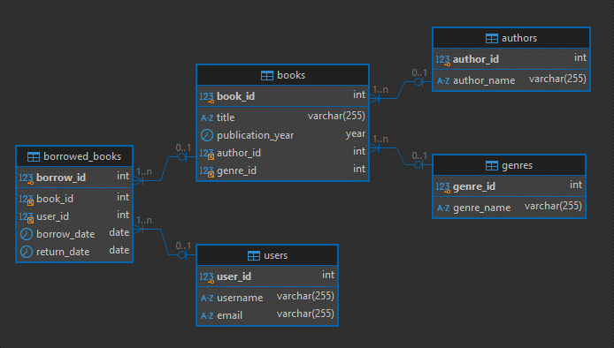
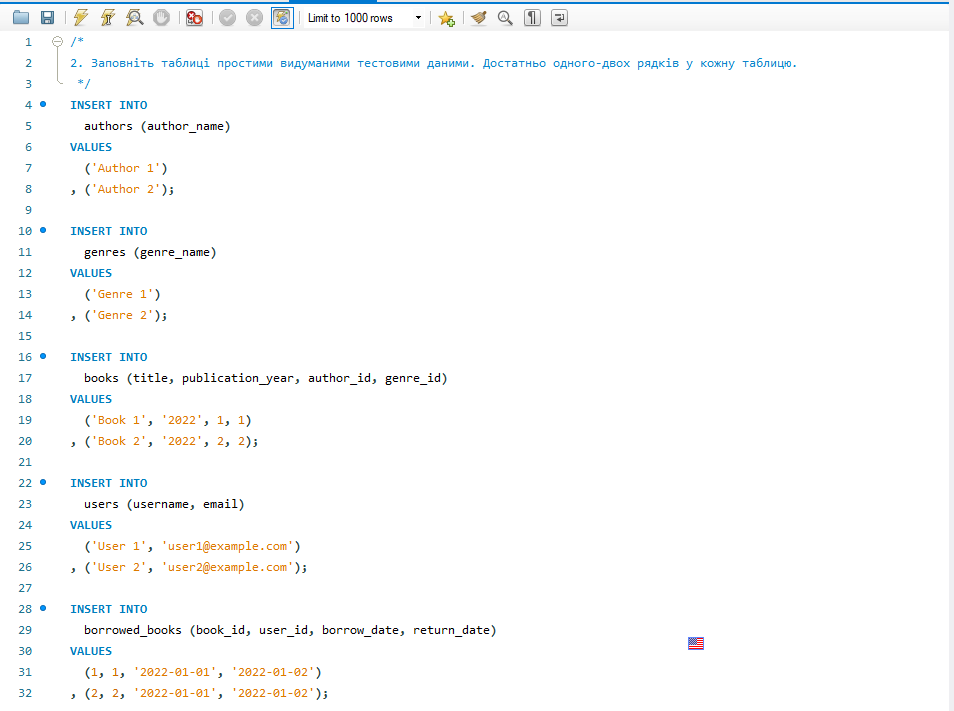
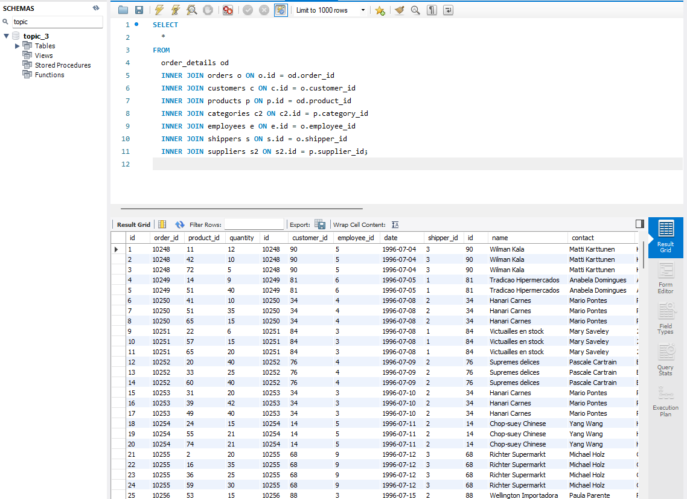
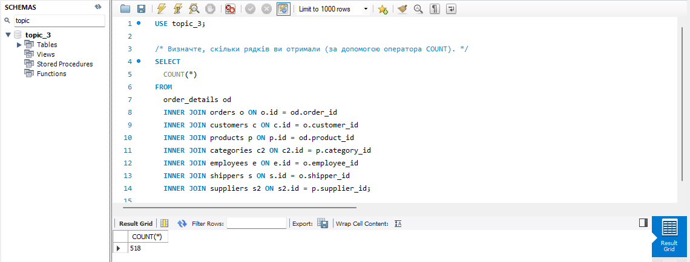
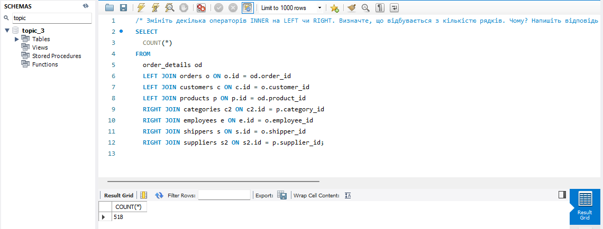
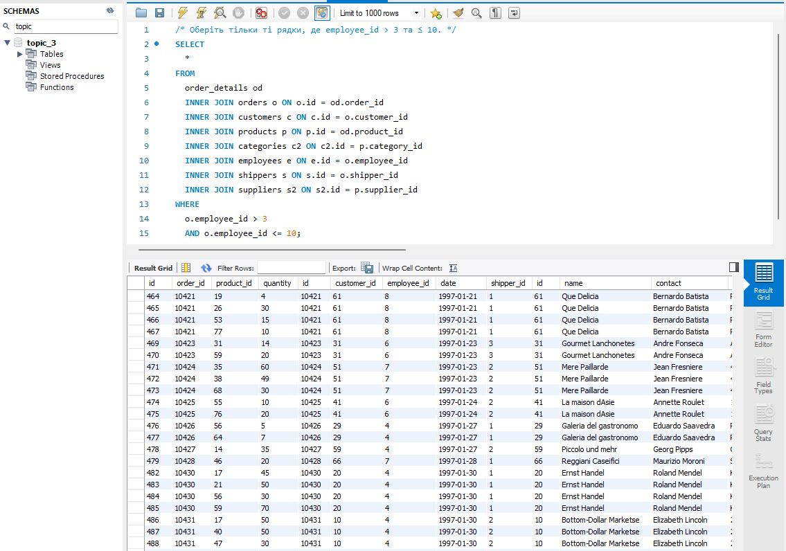
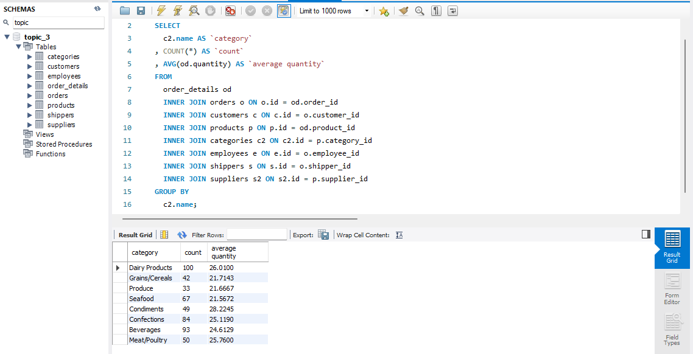
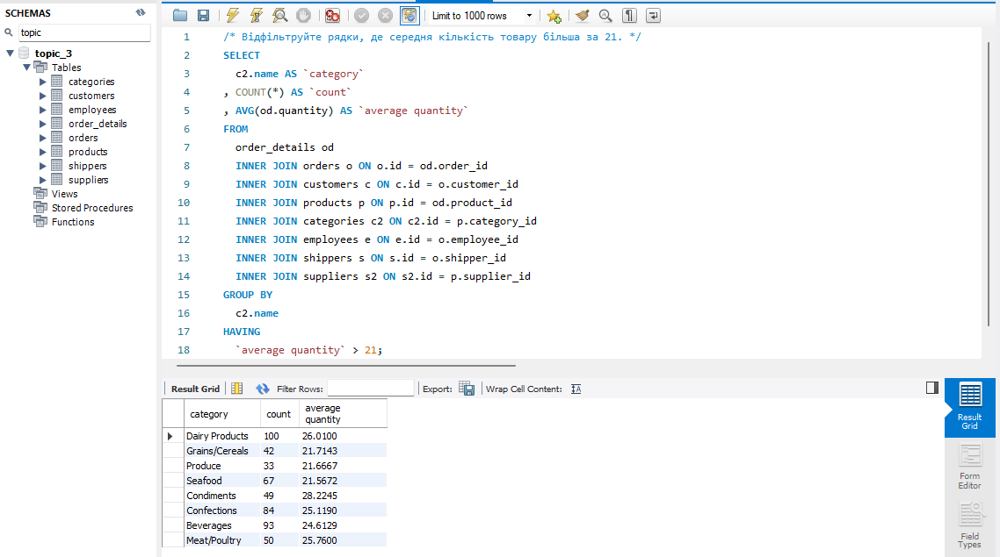
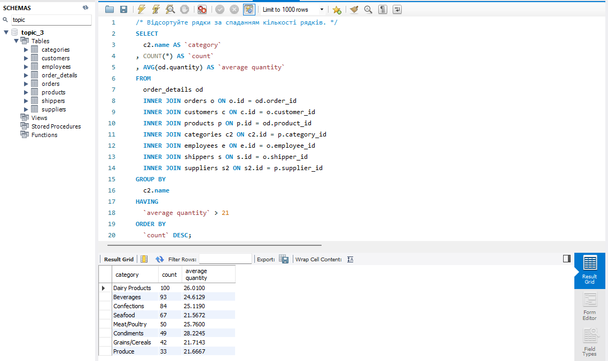
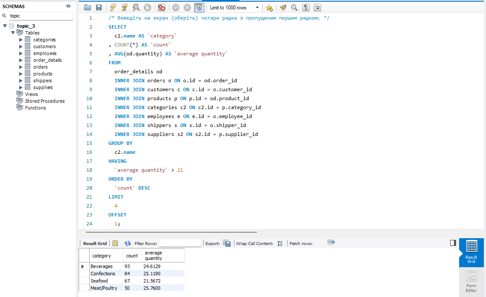

# goit-rdb-hw-04 DML та DDL команди. Складні SQL вирази

## Завдання 1

1\. Створіть базу даних для керування бібліотекою книг згідно зі структурою, наведеною нижче. Використовуйте DDL-команди для створення необхідних таблиць та їх зв'язків.

**Структура БД**

a) Назва схеми — “LibraryManagement”

b) Таблиця "authors":

- author_id (INT, автоматично зростаючий PRIMARY KEY)
- author_name (VARCHAR)

c) Таблиця "genres":

- genre_id (INT, автоматично зростаючий PRIMARY KEY)
- genre_name (VARCHAR)

d) Таблиця "books":

- book_id (INT, автоматично зростаючий PRIMARY KEY)
- title (VARCHAR)
- publication_year (YEAR)
- author_id (INT, FOREIGN KEY зв'язок з "Authors")
- genre_id (INT, FOREIGN KEY зв'язок з "Genres")

e) Таблиця "users":

- user_id (INT, автоматично зростаючий PRIMARY KEY)
- username (VARCHAR)
- email (VARCHAR)

f) Таблиця "borrowed_books":

- borrow_id (INT, автоматично зростаючий PRIMARY KEY)
- book_id (INT, FOREIGN KEY зв'язок з "Books")
- user_id (INT, FOREIGN KEY зв'язок з "Users")
- borrow_date (DATE)
- return_date (DATE)

---

### Рішення 1

SQL-код: [p1.sql](p1.sql)

Діаграма створеної схеми



## Завдання 2

2\. Заповніть таблиці простими видуманими тестовими даними. Достатньо одного-двох рядків у кожну таблицю.

---

### Рішення 2

SQL-код: [p2.sql](p2.sql)

Скрін



## Завдання 3

3\. Перейдіть до бази даних, з якою працювали у темі 3. Напишіть запит за допомогою операторів FROM та INNER JOIN, що об’єднує всі таблиці даних, які ми завантажили з файлів: order_details, orders, customers, products, categories, employees, shippers, suppliers. Для цього ви маєте знайти спільні ключі.

Перевірте правильність виконання запиту.

---

### Рішення 3

SQL-код: [p3.sql](p3.sql)

Скрін результату



## Завдання 4

4\. Виконайте запити, перелічені нижче.

### 4.1

Визначте, скільки рядків ви отримали (за допомогою оператора COUNT).

```SQL
USE topic_3;

/* Визначте, скільки рядків ви отримали (за допомогою оператора COUNT). */
SELECT
  COUNT(*)
FROM
  order_details od
  INNER JOIN orders o ON o.id = od.order_id
  INNER JOIN customers c ON c.id = o.customer_id
  INNER JOIN products p ON p.id = od.product_id
  INNER JOIN categories c2 ON c2.id = p.category_id
  INNER JOIN employees e ON e.id = o.employee_id
  INNER JOIN shippers s ON s.id = o.shipper_id
  INNER JOIN suppliers s2 ON s2.id = p.supplier_id;
```

Отримано 518 записів.

Скрін результату



### 4.2

Змініть декілька операторів INNER на LEFT чи RIGHT. Визначте, що відбувається з кількістю рядків. Чому? Напишіть відповідь у текстовому файлі.

```SQL
/* Змініть декілька операторів INNER на LEFT чи RIGHT. Визначте, що відбувається з кількістю рядків. Чому? Напишіть відповідь у текстовому файлі. */
SELECT
  COUNT(*)
FROM
  order_details od
  LEFT JOIN orders o ON o.id = od.order_id
  LEFT JOIN customers c ON c.id = o.customer_id
  LEFT JOIN products p ON p.id = od.product_id
  RIGHT JOIN categories c2 ON c2.id = p.category_id
  RIGHT JOIN employees e ON e.id = o.employee_id
  RIGHT JOIN shippers s ON s.id = o.shipper_id
  RIGHT JOIN suppliers s2 ON s2.id = p.supplier_id;
```

Скрін результату



- Після зміни частини об’єднань на LEFT JOIN і частини на RIGHT JOIN отримано такий самий результат – 518 записів.
- Це свідчить про те, що всі записи в таблицях мають відповідні зв’язки, і жодна з таблиць не додає рядків із NULL у результат.
- Іншими словами: кожне значення зовнішнього ключа (FK) має відповідне значення основного ключа (PK), що забезпечує повний збіг у всіх об'єднаних таблицях.

### 4.3

Оберіть тільки ті рядки, де employee_id \> 3 та ≤ 10.

```SQL
/* Оберіть тільки ті рядки, де employee_id > 3 та ≤ 10. */
SELECT
  *
FROM
  order_details od
  INNER JOIN orders o ON o.id = od.order_id
  INNER JOIN customers c ON c.id = o.customer_id
  INNER JOIN products p ON p.id = od.product_id
  INNER JOIN categories c2 ON c2.id = p.category_id
  INNER JOIN employees e ON e.id = o.employee_id
  INNER JOIN shippers s ON s.id = o.shipper_id
  INNER JOIN suppliers s2 ON s2.id = p.supplier_id
WHERE
  o.employee_id > 3
  AND o.employee_id <= 10;
```

Скрін результату



### 4.4

Згрупуйте за іменем категорії, порахуйте кількість рядків у групі, середню кількість товару (кількість товару знаходиться в order_details.quantity)

```SQL
/* Згрупуйте за іменем категорії, порахуйте кількість рядків у групі, середню кількість товару (кількість товару знаходиться в order_details.quantity) */
SELECT
  c2.name AS `category`
, COUNT(*) AS `count`
, AVG(od.quantity) AS `average quantity`
FROM
  order_details od
  INNER JOIN orders o ON o.id = od.order_id
  INNER JOIN customers c ON c.id = o.customer_id
  INNER JOIN products p ON p.id = od.product_id
  INNER JOIN categories c2 ON c2.id = p.category_id
  INNER JOIN employees e ON e.id = o.employee_id
  INNER JOIN shippers s ON s.id = o.shipper_id
  INNER JOIN suppliers s2 ON s2.id = p.supplier_id
GROUP BY
  c2.name;
```

Скрін результату



### 4.5

Відфільтруйте рядки, де середня кількість товару більша за 21.

```SQL
/* Відфільтруйте рядки, де середня кількість товару більша за 21. */
SELECT
  c2.name AS `category`
, COUNT(*) AS `count`
, AVG(od.quantity) AS `average quantity`
FROM
  order_details od
  INNER JOIN orders o ON o.id = od.order_id
  INNER JOIN customers c ON c.id = o.customer_id
  INNER JOIN products p ON p.id = od.product_id
  INNER JOIN categories c2 ON c2.id = p.category_id
  INNER JOIN employees e ON e.id = o.employee_id
  INNER JOIN shippers s ON s.id = o.shipper_id
  INNER JOIN suppliers s2 ON s2.id = p.supplier_id
GROUP BY
  c2.name
HAVING
  `average quantity` > 21;
```

Скрін результату



### 4.6

Відсортуйте рядки за спаданням кількості рядків.

```SQL
/* Відсортуйте рядки за спаданням кількості рядків. */
SELECT
  c2.name AS `category`
, COUNT(*) AS `count`
, AVG(od.quantity) AS `average quantity`
FROM
  order_details od
  INNER JOIN orders o ON o.id = od.order_id
  INNER JOIN customers c ON c.id = o.customer_id
  INNER JOIN products p ON p.id = od.product_id
  INNER JOIN categories c2 ON c2.id = p.category_id
  INNER JOIN employees e ON e.id = o.employee_id
  INNER JOIN shippers s ON s.id = o.shipper_id
  INNER JOIN suppliers s2 ON s2.id = p.supplier_id
GROUP BY
  c2.name
HAVING
  `average quantity` > 21
ORDER BY
  `count` DESC;
```

Скрін результату



### Виведіть на екран (оберіть) чотири рядки з пропущеним першим рядком.

```SQL
/* Виведіть на екран (оберіть) чотири рядки з пропущеним першим рядком. */
SELECT
  c2.name AS `category`
, COUNT(*) AS `count`
, AVG(od.quantity) AS `average quantity`
FROM
  order_details od
  INNER JOIN orders o ON o.id = od.order_id
  INNER JOIN customers c ON c.id = o.customer_id
  INNER JOIN products p ON p.id = od.product_id
  INNER JOIN categories c2 ON c2.id = p.category_id
  INNER JOIN employees e ON e.id = o.employee_id
  INNER JOIN shippers s ON s.id = o.shipper_id
  INNER JOIN suppliers s2 ON s2.id = p.supplier_id
GROUP BY
  c2.name
HAVING
  `average quantity` > 21
ORDER BY
  `count` DESC
LIMIT
  4
OFFSET
  1;
```

Скрін результату



SQL-код: [p4.sql](p4.sql)
